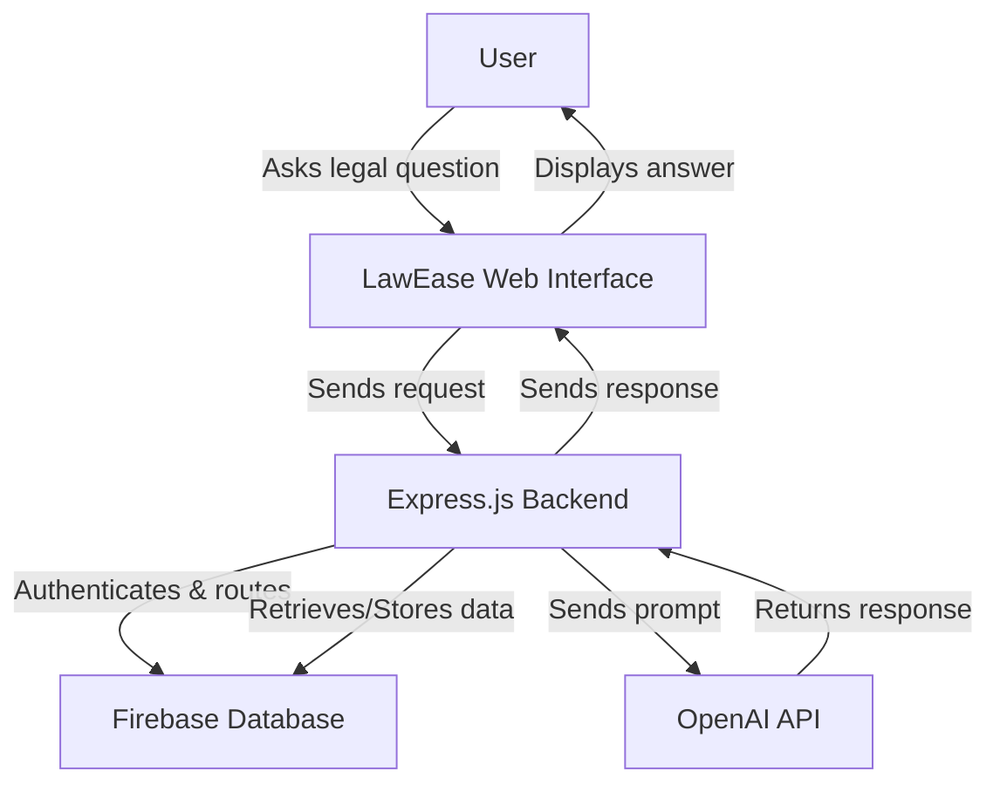

# LAWEASE 🤖⚖️

[](https://law-ease.vercel.app/)
[](https://law-ease.vercel.app/)

## ⚠️ Important Notice

> **This is currently a prototype version!** The frontend demo is for visualization purposes only and is not yet fully functional. To test the complete functionality, please clone the repository and use your own OpenAI API key with the backend setup.

## What is LawEase? 🎯

LawEase is an intelligent legal assistant (lawbot) designed specifically for Indian law queries. It provides quick, reliable assistance with various law-related topics, making legal information more accessible to everyone.

## Preview 👀


## How It Works 🛠️

LawEase leverages cutting-edge technologies to deliver accurate legal information:



### Core Components:

- **Frontend**: User-friendly interface built with React
- **Backend**: Robust Express server handling requests
- **AI Processing**: OpenAI API integration for legal analysis
- **Data Management**: Firebase for secure data storage and authentication

## Technology Stack 💻

### Frontend

- [React](https://react.dev/) - Modern UI framework
- [Tailwind CSS](https://tailwindcss.com/) - Styling and components
- [Vite](https://vitejs.dev/) - Build tool and development server

### Backend

- [Node.js](https://nodejs.org/) - Runtime environment
- [Express](https://expressjs.com/) - Web application framework
- [OpenAI API](https://openai.com/blog/openai-api) - AI processing
- [Firebase](https://firebase.google.com/) - Database and authentication

## Getting Started 🚀

### Prerequisites

- Node.js (v14 or higher)
- npm or yarn
- OpenAI API key
- Firebase account

### Local Development Setup

1. Clone the repository:

```bash
git clone https://github.com/yourusername/lawease.git
cd lawease
```

2. Install dependencies:

```bash
# Frontend
cd frontend
npm install

# Backend
cd ../backend
npm install
```

3. Configure environment variables:

```bash
# Backend .env
OPENAI_API_KEY=your_api_key_here
FIREBASE_CONFIG={your_firebase_config}

# Frontend .env
VITE_API_URL=http://localhost:3000
```

4. Start the development servers:

```bash
# Backend
npm run dev

# Frontend (in a new terminal)
cd frontend
npm run dev
```

## Demo 🎮
- ⚠️ Note: This is a prototype frontend demo only. Backend functionality requires local setup with your API keys.

## Contributing 🤝

Contributions are welcome! Please feel free to submit a Pull Request.

## License 📄

This project is licensed under the MIT License - see the [LICENSE](LICENSE) file for details.

## Contact 📬

- Project Link: [https://github.com/pranavranjithkannan/CDS087](https://github.com/pranavranjithkannan/CDS087)
- Demo Link: [https://lawease.me/](https://lawease.me/)

---

⚠️ **Disclaimer**: This is a prototype project and should not be used as a substitute for professional legal advice. Always consult with a qualified legal professional for specific legal matters.
